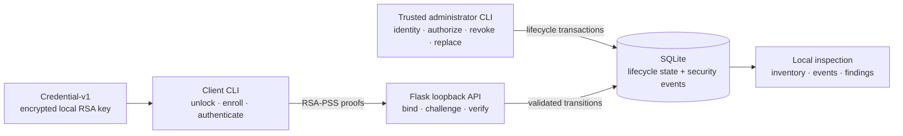

# Passwordless Identity Security Lab

[](https://github.com/Yaser-Me/public-key-authentication-system/actions/workflows/ci.yml)

A local, CLI-first identity-security lab for controlled software-authenticator
enrollment, credential custody, RSA-PSS challenge-response authentication,
terminal revocation and replacement, and local security evidence.

Built with Python 3.12, Flask, SQLite, and `cryptography`. It returns
authentication decisions rather than creating application sessions, and it does
not claim production IAM.

## System at a glance



## What the lifecycle enforces

- Enrollment authorizations are scoped, expiring, and single-use; binding
  requires RSA-PSS proof of possession, while an uncertain response can
  reconcile only the same committed key.
- Credential-v1 uses Argon2id and AES-256-GCM, no-overwrite publication, and
  local unlock before challenge issuance.
- PKAS-AUTH-V2 signs a context-bound RSA-PSS challenge; SQLite allows each
  expiring challenge to succeed once, including under concurrent verification.
- Revocation is terminal, and replacement revokes first before enrolling a
  distinct binding and key.
- Authoritative state changes and success events commit together; denial
  evidence and derived findings remain bounded and cautiously attributed.

## Important boundaries

- The trusted local OS account is the administration boundary; mutually
  untrusted local users are outside scope.
- Enrollment uses loopback HTTP. The lab does not claim protected-channel or
  phishing resistance.
- Credentials are software, passphrase-protected application files—not
  hardware-backed storage or protection from same-account malware.
- Events share the local SQLite and OS boundary. They are not tamper-proof,
  independently attributable, centrally retained, or automated alerts.

## Prerequisite

Python 3.12 is required. In an ordinary interactive PowerShell terminal, check
the interpreter before creating the project environment:

```powershell
python --version
```

Continue only if this reports `Python 3.12.x`. On Windows, install Python from
the official [Python 3.12.10 release page](https://www.python.org/downloads/release/python-31210/)
if it is missing. Python 3.12.10 was the last 3.12 release with official Windows
binary installers; [later 3.12 security releases are source-only](https://www.python.org/downloads/release/python-31213/).
If the Python Launcher is available but `python` is not, use
`py -3.12 --version` for the check and `py -3.12 -m venv .venv` below.

Application packages belong in the project virtual environment. The
`requirements.txt` file supplies Flask, `cryptography`, Requests, and their
transitive dependencies through pip. The normal Windows installation uses
`cryptography`'s [published wheel](https://cryptography.io/en/latest/installation/),
so Rust, OpenSSL, and compiler toolchains are not normal prerequisites.

## Run the lab

Use an ordinary interactive PowerShell terminal. The client refuses to read
secrets when hidden input is unavailable.

### Terminal 1: prepare, initialize, and start the API

```powershell
python --version
python -m venv .venv
.\.venv\Scripts\Activate.ps1
python -m pip install -r requirements.txt
python manage.py init
python server.py
```

Leave the server running. This first walkthrough creates persistent local state
under `%LOCALAPPDATA%\PublicKeyAuthenticationSystem`; set
`PKAS_DATABASE_PATH` if you want a separate SQLite instance.

### Terminal 2: activate the environment, then enroll and authenticate

```powershell
.\.venv\Scripts\Activate.ps1
python manage.py identity-add demo
python manage.py enrollment-issue demo laptop
```

`enrollment-issue` displays an authorization ID and bearer secret once. Copy the
ID into the next command; the client prompts for the secret so it stays out of
command history. Choose a new passphrase of at least 15 characters.

```powershell
python client.py enroll demo laptop AUTHORIZATION_ID
python client.py login demo laptop
```

Enrollment returns `created`; login returns `success`.

### Contain the original binding and replace it

```powershell
python manage.py replacement-prepare demo laptop replacement suspected_compromise
```

This terminally revokes `laptop` and displays a replacement authorization ID and
bearer secret. Before using it, try the old credential again:

```powershell
python client.py login demo laptop
```

This denial is expected: the command reports `authentication_denied` and exits
nonzero because a revoked binding cannot receive a challenge. It proves that a
request targeted a revoked binding and was rejected. It does not prove that the
original private key, credential, or authenticator generated that request.

Enroll the distinct replacement with the authorization ID from
`replacement-prepare`, then authenticate with it:

```powershell
python client.py enroll demo replacement REPLACEMENT_AUTHORIZATION_ID
python client.py login demo replacement
```

### Inspect the result

```powershell
python manage.py inventory --user-id demo
python manage.py events --user-id demo
python manage.py investigate --user-id demo --device-id laptop
```

Inventory shows the original `laptop` binding as revoked and `replacement` as
active. Events are chronological, sanitized local evidence. The bounded
investigation links the replacement preparation and the denied old-binding
request as `post_revocation_targeting`; it makes no claim about who sent that
request.

Restricted Windows environments may enforce application-control policy against
native Python extensions. In the fresh Windows Sandbox tested for this project,
Windows Application Control blocked `cryptography`'s `_rust.pyd` at runtime
after package installation succeeded. Do not disable security controls to run
the lab; use an environment where the required packages are permitted, or
consult the system administrator.

## Project map

| Path | Responsibility |
|---|---|
| `manage.py` | Trusted-local lifecycle and inspection commands |
| `client.py` / `credential_store.py` | Enrollment, authentication, Credential-v1 custody, and migration |
| `server.py` / `crypto_utils.py` | HTTP boundary and RSA-PSS protocol operations |
| `db_utils.py` | SQLite lifecycle, transactions, evidence, and analysis |
| `tests/` | Protocol, migration, rollback, concurrency, and failure evidence |
| `docs/` | Lifecycle, credential-storage, and security-evidence details |

## Validation

CI compiles and runs the full suite on Python 3.12 for Windows and Ubuntu. Run
the same checks locally:

```powershell
.\.venv\Scripts\python.exe -m compileall -q .
.\.venv\Scripts\python.exe -m unittest discover -s tests -v
.\.venv\Scripts\python.exe -m pip check
```

## Design notes

- [Authenticator lifecycle](docs/authenticator-lifecycle.md)
- [Credential storage](docs/credential-storage.md)
- [Security evidence and findings](docs/security-evidence.md)

Existing v1, v2, or v3 SQLite state requires explicit migration; see the
lifecycle note before running `.\.venv\Scripts\python.exe manage.py migrate`.
