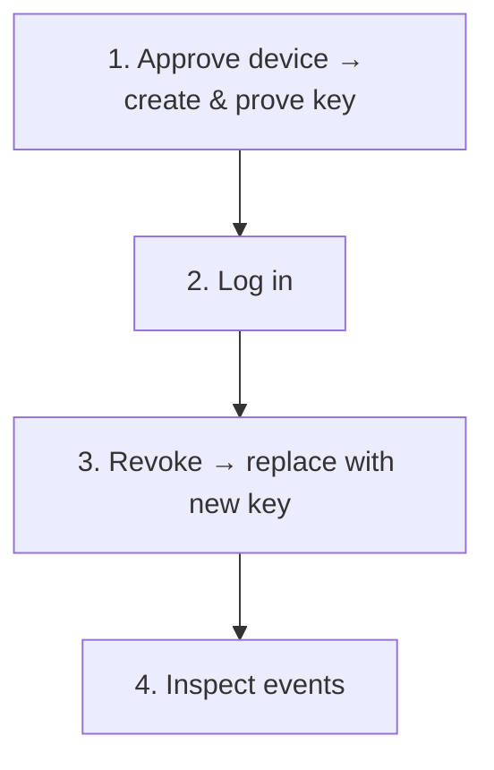

# Passwordless Identity Security Lab

[](https://github.com/Yaser-Me/public-key-authentication-system/actions/workflows/ci.yml)

This is a small local login system. Instead of checking a password, the server
asks an approved device to prove that it owns a private key. The device does
that by signing a fresh challenge from the server.

An administrator decides which device may join. If that device should no longer
be trusted, its access is permanently revoked; a replacement joins with a new
key. The lab records the important security events so you can inspect what
happened afterward.

“Passwordless” describes authentication to the service: no password is sent to
the server. A passphrase is still used locally to unlock the encrypted private
key. This is not WebAuthn/FIDO or production IAM.

## What happens in this lab



The administrator first grants temporary permission for one identity and one
device. The device creates its private key and proves that it owns it. Each login
then requires the device to sign a new challenge from the server.

If the device is revoked, it cannot log in again. Its replacement creates a
different key rather than restoring the old one. The project calls each approved
device-and-key relationship an **authenticator binding**; its lifecycle and the
important denied requests remain available for inspection.

## Run the lifecycle

The walkthrough uses PowerShell and Python 3.12. Download or clone the
repository, then open an ordinary PowerShell terminal in its directory.

### Prerequisite

Check the installed interpreter:

```powershell
python --version
```

Continue only if this reports `Python 3.12.x`. On Windows, use the official
[Python 3.12.10 release](https://www.python.org/downloads/release/python-31210/)
if Python is missing. It was the last 3.12 release with official Windows binary
installers; [later 3.12 security releases are source-only](https://www.python.org/downloads/release/python-31213/).

If the Python Launcher is available instead of `python`, use `py -3.12` for the
version check and virtual-environment command.

```powershell
py -3.12 --version
```

### 1. Prepare and start the service

In the first terminal, create the project environment with one of these
commands:

```powershell
python -m venv .venv
```

```powershell
# Python Launcher alternative
py -3.12 -m venv .venv
```

Run only the command that matches your interpreter. Then install the
dependencies, initialize the local database, and start the service:

```powershell
.\.venv\Scripts\python.exe -m pip install -r requirements.txt
.\.venv\Scripts\python.exe manage.py init
.\.venv\Scripts\python.exe server.py
```

Leave this terminal running. The lab stores its normal local state under
`%LOCALAPPDATA%\PublicKeyAuthenticationSystem`. Set `PKAS_DATABASE_PATH` before
initialization if you want to use a separate SQLite database.

### 2. Approve a device, then log in

In a second terminal, create a logical identity and approve a device named
`laptop`:

```powershell
.\.venv\Scripts\python.exe manage.py identity-add demo
.\.venv\Scripts\python.exe manage.py enrollment-issue demo laptop
```

This temporary permission applies only to `demo` and `laptop`. It expires and
can be used once. `enrollment-issue` displays an authorization ID and bearer
secret once.

Now let the device create its private key and prove that it owns it. Copy the
authorization ID into the next command. The client prompts for the secret so it
does not enter command history, then asks for a new credential passphrase of at
least 15 characters.

```powershell
.\.venv\Scripts\python.exe client.py enroll demo laptop AUTHORIZATION_ID
```

Enrollment reports `created`. Try logging in: the server sends a fresh
challenge and the device signs it.

```powershell
.\.venv\Scripts\python.exe client.py login demo laptop
```

Authentication reports `success`.

### 3. Revoke the old device

Now assume `laptop` should no longer be trusted. Prepare a replacement named
`replacement`:

```powershell
.\.venv\Scripts\python.exe manage.py replacement-prepare demo laptop replacement suspected_compromise
```

This permanently revokes `laptop` before granting temporary permission for the
replacement. Try logging in with the old device again:

```powershell
.\.venv\Scripts\python.exe client.py login demo laptop
```

The command reports `authentication_denied` and exits nonzero. The old device
cannot receive another challenge.

That denial proves that a request targeted the revoked binding and was rejected.
It does not prove who sent the request or whether the old private key was used.

### 4. Add the replacement

The replacement creates and proves a new key; it does not inherit the old one.
Use the authorization ID and secret displayed by `replacement-prepare`:

```powershell
.\.venv\Scripts\python.exe client.py enroll demo replacement REPLACEMENT_AUTHORIZATION_ID
.\.venv\Scripts\python.exe client.py login demo replacement
```

The replacement is now a new authenticator binding. It does not restore or
alter the revoked one.

### 5. Inspect what happened

```powershell
.\.venv\Scripts\python.exe manage.py inventory --user-id demo
.\.venv\Scripts\python.exe manage.py events --user-id demo
.\.venv\Scripts\python.exe manage.py investigate --user-id demo --device-id laptop
```

Inventory shows `laptop` as revoked and `replacement` as active. The event
timeline shows the lifecycle in chronological order.

Because the walkthrough deliberately targeted the old binding after revocation,
the investigation reports `post_revocation_targeting`. The finding links to the
events that support it and repeats the limit on attribution.

## What was engineered

The visible walkthrough is small. Most of the engineering work is in the rules
around each transition.

### Controlled enrollment

A device cannot add itself. The trusted local administrator first grants
permission for one identity and one device. This permission is called an
enrollment authorization: it expires and can be used only once. The client then
proves possession of the private key it wants to bind using RSA-PSS.

If the response is lost after a successful commit, an exact retry can reconcile
the same key without creating another binding.

### Protected local credential

The private key remains in a passphrase-protected Credential-v1 file. The client
validates and publishes that file without overwriting an existing credential.
Once an enrollment request may have reached the service, the same credential is
retained so an uncertain result can be retried safely.

### One challenge, one success

Authentication uses RSA-PSS over a context that binds the challenge to the
identity, authenticator, and public key. Challenges expire and can succeed only
once. Transaction ordering ensures that concurrent verification or revocation
cannot turn one challenge into multiple successes.

### Evidence without overclaiming

Authoritative state changes and their success events commit together. If event
insertion fails, the state transition rolls back. Bounded investigation can
identify repeated invalid signatures, replay after a recorded success, and
requests targeting a revoked binding while keeping observation separate from
actor attribution.

## How the behavior is checked

The tests exercise security boundaries rather than only happy-path output. They
cover:

- competing enrollment, authentication, revocation, and replacement operations;
- replay, expiry, context tampering, and legacy-protocol downgrade attempts;
- credential publication races and uncertain enrollment responses;
- rollback when state or evidence cannot commit safely;
- schema recognition and explicit migration from supported legacy state; and
- process-level operation through a real loopback HTTP server.

CI compiles the project and runs the full suite on Python 3.12 for Windows and
Ubuntu.

Run the validation locally:

```powershell
.\.venv\Scripts\python.exe -m compileall -q .
.\.venv\Scripts\python.exe -m unittest discover -s tests -v
.\.venv\Scripts\python.exe -m pip check
```

## Where the model stops

- The trusted local OS account is the administration boundary. Mutually
  untrusted users sharing one OS account are outside scope.
- Enrollment and authentication use loopback HTTP. The lab does not provide a
  protected remote channel or phishing-resistant authentication.
- Credentials are software files. Passphrase protection does not provide
  hardware-backed custody or protection from malware running as the same user.
- Events share the local SQLite and OS trust boundary. They are not tamper-proof,
  centrally retained, or independently attributable, and the derived findings
  are not automated alerts.

The service returns authentication decisions; it does not create application
sessions or act as a general identity provider.

## Go deeper

The [security design](docs/security-design.md) explains exactly how enrollment,
credential custody, authentication, revocation, replacement, transactions,
migrations, and evidence handling work.

The [tests](tests/) are the executable evidence for the failure, concurrency,
rollback, and end-to-end behavior described above.

<details>
<summary>Restricted Windows environments</summary>

Some Windows hosts enforce application-control policy against native Python
extensions. In one fresh Windows Sandbox used during project validation,
Windows Application Control blocked `cryptography`'s `_rust.pyd` after package
installation.

This was a host-policy result, not a general claim about Windows Sandbox. Do not
disable security controls to run the lab. Use an environment where the required
package is permitted, or consult the system administrator.

</details>

## License

This repository is intentionally published without an open-source license.
Public visibility does not grant broad reuse rights.
